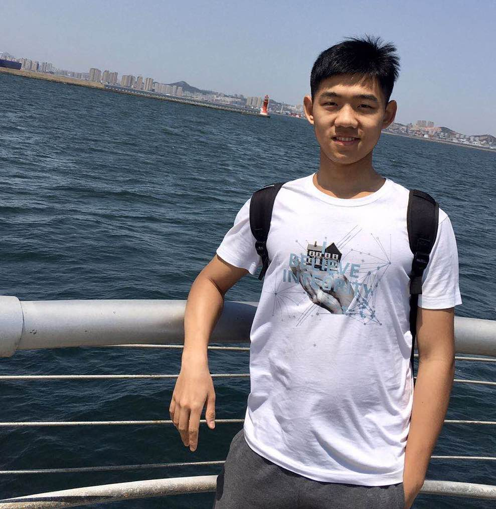

    
    

        
Concact

        
No. 59 Jinye Yilu, Xi’an, China

        

            <a href="mailto:yuzeli@xjtu.edu.cn">yuzeli@xjtu.edu.cn</a>
             
            +86-13319294103
        

    

# Biography

My current research involves data processing and algorithm modification in graphs. Specifically, given a large graph and attributes for each node, how to obtain the Personalized Pagerank (PPR) fast and precisely is the primary focus. Consequently, data compression such as compressed sparse row (CSR) and efficiently dividing a graph into multiple layers to speed up the process are under research. Identically, I am also interested in High Performance Computing (HPC) and distributed system that any system manages to fully utilize hardware resources.

I am looking for PhD program opportunities starting 2021 fall. Feel free to reach me for more information!

## Interests

- High Performance Computing
- Parallel Computing
- Software Engineering

## Education

  
  B.E. in Software Engineering, 2020

Northeastern University, China

  
  Exchange Study in Computer Science, 2018

Boston University

## Publication

**Yuze Li**, Kaijun Wang and Hehui Gu. [Maven Loss with AGW-Net for Biomedical Image Segmentation](https://doi.org/10.1145/3404555.3404561). In ACM Proceeding, 2020 6th International Conference on Computing and Artificial Intelligence (ICCAI), Tianjin, China, April 2020

## Exployments

### *Research Assistant*, 07/2020 - Present

Key Laboratory of Intelligent Network and Network Security,  XJTU, Xi'an

- Data processing and model refinement in graphs
- Reading relevant papers published in recent years and give presentations to PhD students

### *Full Stack SDE Intern*, 03/2020 - 06/2020

Shaanxi Bestsinuo Information Technology Co., Ltd, Xi'an

- Responsible for implementing a Cylinder Management Platform based on Java
- Used SSM framework, Vue + Element as frontend, MySQL in Docker as database

### *Backend SDE Intern*, 05/2019 - 07/2019

Neuedu Corporation, Shenyang

- Created a web-based hospital information management system

## Professional Experiences

### *Temperature, Humidity Monitoring and Indoor Scene Monitoring Platform*, 05/2019

- Developed a platform for users to monitor temperature, humidity, and indoor scenes
- Applied Raspberry Pi 3B for the host, DHT 11 for T, H sensor, Pi-camera for a monitor, and WeChat for a server
- Project was included in school’s achievement repository for exhibition

### *2018 11th Chinese Undergraduate Computer Design Contest*, 08/2018

Donghua University, Shanghai

- Used HTML5 to draw the canvas for the game to display and pure JavaScript to construct the movement of a bird
- Won the 3rd Prize, National Level

### *Natural Language Processing Research*, 07/2018

Institute of Computing Technology, Chinese Academy of Sciences, Beijing

- Led the team to complete three projects including wine quality research, concrete compressive strength research, and Chinese text segmentation on the plain text
- Used KNN, SVM, Decision Tree, Naive Bayes, Least Squares algorithms and Linear Regression in the researches, and applied Word2Vec to achieve an automatic categorization of eleven kinds of news
- Improved the model accuracy by 30 percent by intentionally neglect part of one of the interference factors

### *Spot Information Management System*, 06/2018

- Implemented a spot information management system in C++ with knowledge in data structure, generating the best visiting route based on the location of a visitor, calculating the shortest distance of a given pair of spots, car parking management system
- Used Linked List as the basic architecture, adjacency matrix to visualize paths between each pair of spots, used Dijkstra, Floyd, and Depth-first search algorithms in calculating the best visiting route

